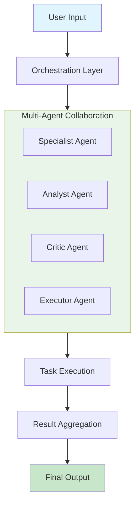
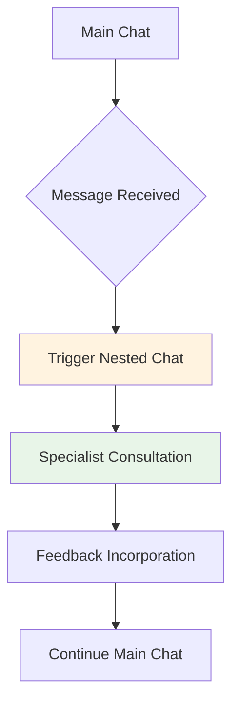
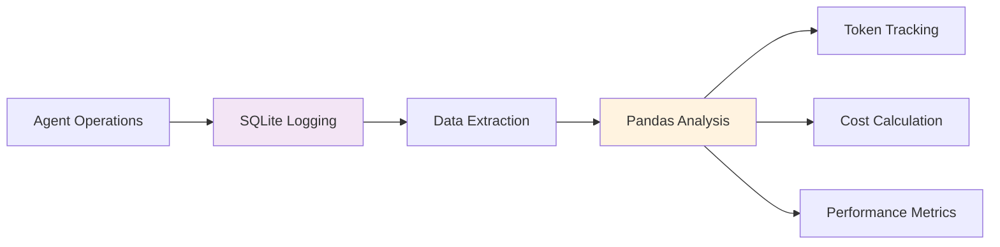
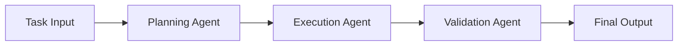
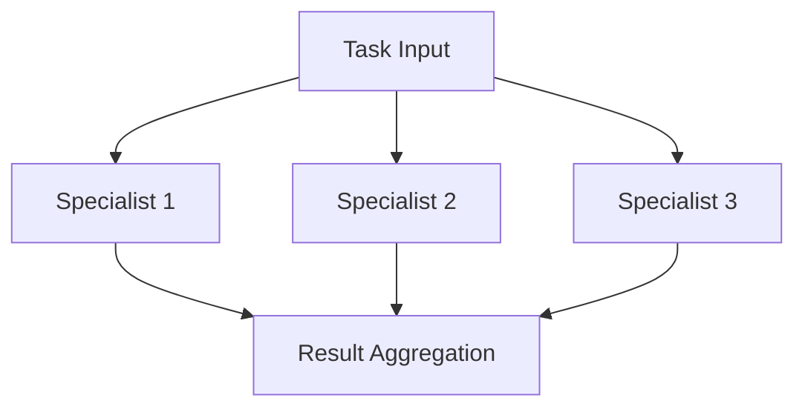

# AutoGen Multi-Agent Systems Framework

A comprehensive collection of AutoGen implementations demonstrating multi-agent systems, nested chats, multimodal conversations, and runtime logging capabilities.

## 📋 Overview

This repository contains multiple AutoGen implementations showcasing different patterns and capabilities of multi-agent systems:

1. **Basic Multi-Agent Collaboration** - Stock analysis and game development workflows
2. **Nested Chat Architecture** - Reflective agent conversations with critics
3. **Multimodal Conversations** - GPT-4 Vision integration for image analysis
4. **Runtime Logging & Analytics** - Comprehensive monitoring and token tracking

## 🏗️ Architecture Diagrams

### Multi-Agent System Flow


### Nested Chat Pattern


## 🚀 Quick Start

### Prerequisites
```bash
pip install pyautogen
pip install pandas sqlite3
```

### Basic Configuration
Create `OAI_CONFIG_LIST.json`:
```json
{
    "model_list": [
        {
            "model": "gpt-4",
            "api_key": "your_api_key_here",
            "base_url": "https://api.openai.com/v1"
        }
    ]
}
```

## 📁 Implementation Examples

### 1. Stock Analysis Agents
**File:** `stock_analysis.py`
```python
# Two-agent system for financial data analysis
# SQL Specialist → Data Analyst workflow
# Features: Natural language to SQL conversion, report generation
```

### 2. Game Development Team
**File:** `game_development.py`
```python
# Three-agent system for game creation
# Product Manager → Coder → Executor workflow
# Features: Automated code generation and execution
```

### 3. Nested Chat Implementation
**File:** `nested_chats.py`
```python
# Reflective agent system with critic feedback
# Writer → Critic nested chat workflow
# Features: Content improvement through reflection
```

### 4. Multimodal Vision Agent
**File:** `multimodal_vision.py`
```python
# GPT-4 Vision integration for image analysis
# Features: Image description, comparison, and analysis
```

### 5. Runtime Logging System
**File:** `runtime_logging.py`
```python
# Comprehensive monitoring and analytics
# Features: SQLite logging, token tracking, cost analysis
```

## 🔧 Key Components

### Agent Types Implemented
- **AssistantAgent** - Core reasoning and task execution
- **UserProxyAgent** - Human interaction and code execution
- **MultimodalConversableAgent** - Image and text processing
- **GroupChatManager** - Multi-agent coordination

### Configuration Patterns
```python
# Basic LLM Configuration
llm_config = {
    "config_list": autogen.config_list_from_json("OAI_CONFIG_LIST.json"),
    "temperature": 0.0,
    "timeout": 120,
}

# Runtime Logging
logging_session_id = autogen.runtime_logging.start(config={"dbname": "logs.db"})
```

## 📊 Logging & Analytics

The framework includes comprehensive logging capabilities:



## 🎯 Use Cases

### Financial Analysis
- Stock price visualization and comparison
- Natural language to SQL conversion
- Automated report generation

### Content Creation
- Multi-step content refinement
- Critical feedback integration
- Quality assurance workflows

### Image Analysis
- Detailed image description
- Comparative analysis
- Contextual understanding

### Development Workflows
- Automated code generation
- Team-based development simulation
- Error detection and correction

## 🔄 Workflow Patterns

### Sequential Collaboration


### Parallel Processing


## 📈 Performance Monitoring

The logging system provides:
- Token usage tracking per session
- Cost calculation and aggregation
- Execution time metrics
- Model performance analytics
- Error rate monitoring

## 🛠️ Customization Guide

### Adding New Agent Types
```python
class CustomAgent(autogen.AssistantAgent):
    def __init__(self, name, specialty):
        super().__init__(
            name=name,
            system_message=f"You are a {specialty} specialist...",
            llm_config=llm_config
        )
```

### Extending Logging
```python
def custom_log_analysis(dbname="logs.db"):
    # Add custom analytics here
    pass
```

## 🤝 Contributing

This framework is designed for extensibility:
1. Add new agent specialties
2. Implement additional workflow patterns
3. Extend logging capabilities
4. Integrate with external services

## 📚 Resources

- [AutoGen Official Documentation](https://microsoft.github.io/autogen/)
- [Multi-Agent Systems Patterns](https://microsoft.github.io/autogen/docs/Use-Cases/agent_chat)
- [Runtime Logging Guide](https://microsoft.github.io/autogen/docs/FAQ#runtime-logging)

## 🏆 Best Practices

1. **Always validate** agent configurations before execution
2. **Implement proper error handling** for robust workflows
3. **Use structured logging** for performance monitoring
4. **Test with different temperature settings** for varied outputs
5. **Implement termination conditions** to control conversation flow

## 📄 License

This project is provided for educational and research purposes. Please ensure proper compliance with OpenAI's usage policies when deploying in production environments.

---

**Note**: Remember to secure your API keys and configure appropriate usage limits when working with language models.